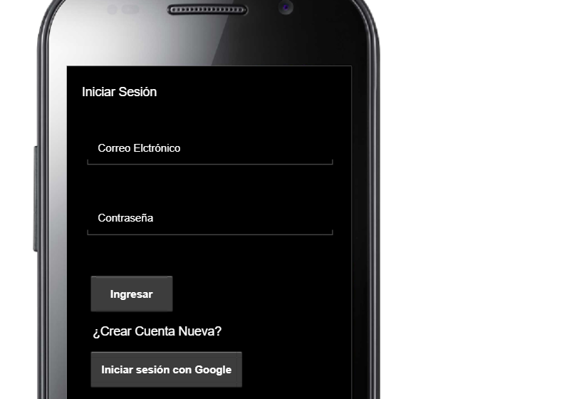
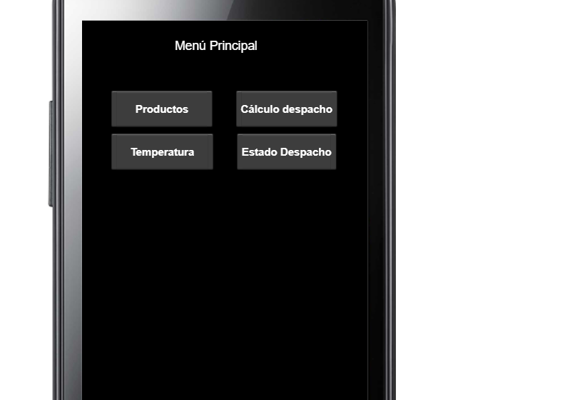
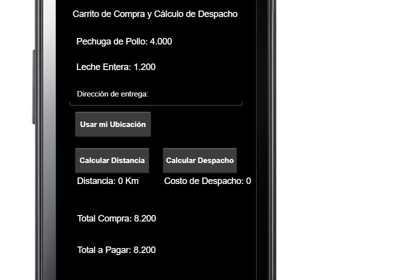
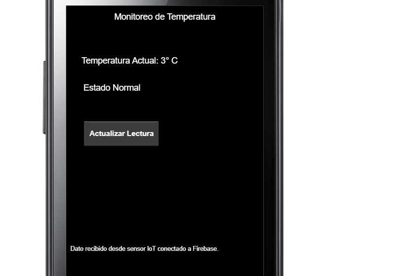
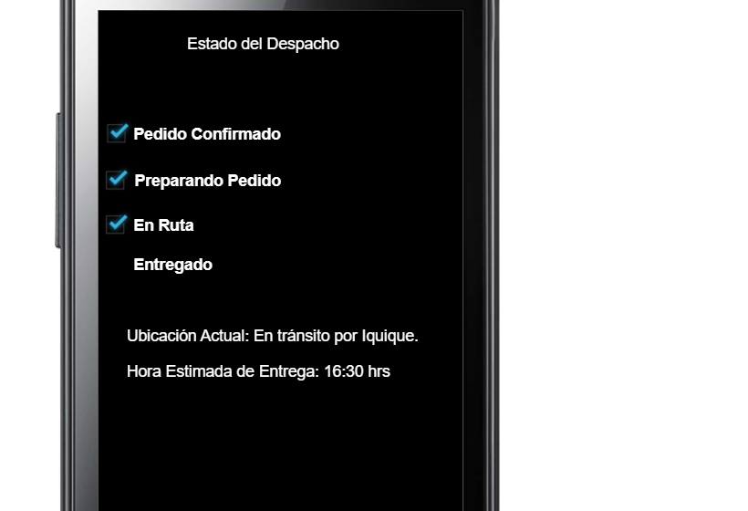

# 📱 Prototipo No Funcional – App Despacho Frío  
**Semana 7 – Taller de Aplicaciones Móviles**

Este repositorio contiene el prototipo no funcional desarrollado con **Pencil Project**, correspondiente a la etapa de diseño de la aplicación móvil **Despacho Frío**, cuyo objetivo es gestionar pedidos, calcular despachos, monitorear temperatura y permitir el seguimiento de entregas.

---

## 📦 Contenido del proyecto

- 📁 `prototipo/` – Carpeta con las pantallas exportadas en formato PNG desde Pencil Project.  
- 📄 `README.md` – Documentación del proyecto y descripción del prototipo.

---

## 🧭 Flujo de Navegación

1. **Pantalla_Login** – Permite iniciar sesión con correo/contraseña o con cuenta de Google.  
2. **Pantalla_Menu** – Menú principal con accesos a todas las funcionalidades.  
3. **Pantalla_Catálogo** – Listado de productos seleccionables mediante casillas.  
4. **Pantalla_Carrito** – Muestra el detalle del pedido, permite calcular distancia y costo de despacho usando ubicación.  
5. **Pantalla_Temperatura** – Monitorea la temperatura del transporte en tiempo real a través de un sensor IoT.  
6. **Pantalla_EstadoDespacho** – Muestra el progreso del pedido desde la confirmación hasta la entrega final.

---

## 📸 Vistas del Prototipo

| Pantalla | Descripción |
|----------|-------------|
|  | Inicio de sesión con credenciales o Gmail. |
|  | Accesos principales de la aplicación. |
|  | Selección de productos con casillas. |
|  | Cálculo de despacho usando ubicación. |
|  | Monitoreo de temperatura en tiempo real. |
|  | Seguimiento del estado del pedido. |

---

## 📊 Tecnologías utilizadas

- 🛠️ **Pencil Project** – Herramienta de diseño de prototipos.  
- ☁️ **Firebase (referencia)** – Backend en la nube para autenticación y datos.  
- 📍 **Google Maps API (referencia)** – Cálculo de distancia y ubicación.  

---
---

## 📌 Próximos pasos

- Integrar este prototipo con la aplicación Android desarrollada en semanas anteriores.  
- Implementar la funcionalidad real de monitoreo de temperatura mediante un sensor IoT conectado a Firebase.  
- Automatizar el cálculo de distancia y costo de despacho usando la API de Google Maps.  
- Desplegar la aplicación final para pruebas de usuario y validación del flujo completo.

